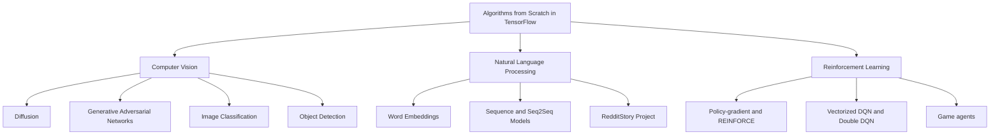

# 🧠 Algorithms from Scratch in TensorFlow

**Algorithms from Scratch in TensorFlow** is a learning-oriented collection of
computer-vision, natural-language-processing, and reinforcement-learning
implementations built directly from TensorFlow operations and model components.
The goal is to expose the mechanics behind an algorithm—its tensors, losses,
updates, data flow, and runtime behaviour—rather than hide it behind a
task-specific high-level API.

> The repository is source-first. Datasets, checkpoints, TensorBoard events,
> generated figures, caches, and model exports are intentionally local-only.

## ✨ Why this repository exists

TensorFlow is used here as a numerical and automatic-differentiation runtime:
`tf.Tensor` for vectorized computation, `tf.data` for input pipelines,
`tf.GradientTape` for custom learning steps, and `tf.distribute` where a
training family supports multiple devices. The implementations make it possible
to trace mathematical ideas into executable tensor programs and inspect their
practical trade-offs: batching, broadcasting, memory, stability, and compute.

## 🗺️ Map of the repository



## 🚀 Implemented families

| Area | Algorithms and architectures | TensorFlow techniques visible in source | Documentation |
| --- | --- | --- | --- |
| Diffusion | Diffusion probabilistic models, DDPM, Improved DDPM, DDIM, GLIDE, Imagen, DALL-E 2, Stable Diffusion, ControlNet, consistency models | Custom `tf.keras.Model`/layers, `GradientTape`, `tf.function`, `tf.data`, optional distribution strategies | [Diffusion](ComputerVision/Diffusion/README.md) |
| GANs | Initial GAN, DCGAN, LSGAN, WGAN, WGAN-GP, Conditional GAN, CycleGAN, StarGAN, StyleGAN, SRGAN, Progressive GAN | Explicit adversarial losses and custom training steps | [GANs](ComputerVision/GenerativeAdvesarialNetworks/README.md) |
| Image classification | LeNet, ZFNet, SqueezeNet, XNOR-Net, MobileNet, ShuffleNet, MLP-Mixer, Xception, AlexNet, VGG, Inception, ResNet, DenseNet, ViT, and more | Custom model assembly, datasets, callbacks, selected multi-GPU paths | [Image classification](ComputerVision/ImageClassification/README.md) |
| Detection and robustness | R-CNN through YOLOv3, SSD, Mask R-CNN; adversarial/saliency attack scripts | Custom heads/losses, `tf.data`, `GradientTape`, distributed detector runs | [Object detection](ComputerVision/ObjectDetection/README.md) · [Robustness](ComputerVision/ImageClassification/Robustness/README.md) |
| NLP | One-hot/co-occurrence/PPMI-SVD/Word2Vec/GloVe/FastText, RNN/LSTM/GRU, attention seq2seq, copy/coverage, Transformer seq2seq | `tf.data`, custom layers/models, selected `MirroredStrategy` paths | [NLP](NaturalLanguageProcessing/README.md) |
| Language-model project | RedditStory BPE tokenizer, TFRecords, decoder-only Transformer, evaluation and sampling | `tf.data`, `GradientTape`, causal masking, KV cache, optional XLA/runtime controls | [RedditStory](NaturalLanguageProcessing/Project/RedditStory/README.md) |
| Reinforcement learning | REINFORCE, policy-gradient/critic variants, vectorized DQN/Double DQN, Tic-Tac-Toe and Connect4 agents | `GradientTape`, `tf.function`, replay/trajectory buffers, TensorBoard summaries | [Reinforcement learning](ReinforcementLearning/README.md) |

Some directories are intentionally documented as **scaffolds** when their
tracked source is empty or contains explicit `NotImplementedError`/`pass`
placeholders. They are not presented as complete experiments.

## 📂 Structure

```text
.
├── ComputerVision/
│   ├── Diffusion/
│   ├── GenerativeAdvesarialNetworks/
│   ├── ImageClassification/
│   └── ObjectDetection/
├── NaturalLanguageProcessing/
│   ├── WordEmbeddings/
│   ├── SequenceModels/
│   ├── Seq2Seq/
│   └── Project/RedditStory/
├── ReinforcementLearning/
│   ├── SingleEnv/
│   ├── Vectorized/
│   └── Project/
└── LICENSE
```

## ⚙️ TensorFlow techniques represented

| Technique | Used for |
| --- | --- |
| `tf.keras.Model` and custom layers | Architectures, detector heads, attention blocks, embedding models, and game/RL networks |
| `tf.GradientTape` | GAN, diffusion, detector, adversarial-attack, and RL update steps |
| `tf.function` | Compiled high-frequency train/update paths in several GAN, diffusion, and RL implementations |
| `tf.data` | Streaming image/text/detection datasets and the RedditStory TFRecord pipeline |
| `tf.distribute.MirroredStrategy` | Multi-device capable paths in selected CV, NLP, and RL families |
| `tf.summary` | TensorBoard scalars in detector and reinforcement-learning runs |

GPU acceleration is most useful for batched convolution, attention, dense
matrix operations, and vectorized environment updates. The code also contains
CPU fallbacks in many entry points; device availability and local datasets
remain runtime prerequisites.

## 🧮 Mathematical themes

The source implements adversarial minimax objectives, score/noise-prediction
losses, cross-entropy classification, sequence likelihood, attention,
co-occurrence and factorisation objectives, temporal-difference learning, and
policy-gradient returns. Complexity depends on each family: attention is
quadratic in sequence length, dense convolutional models scale with spatial
activation volume, and replay-based RL scales with batch sampling and network
updates. Technical pages state only the complexity justified by their code.

## 🧪 Validation and results

The repository includes executable training/evaluation scripts, some detector
tests, and configuration-driven runs. It does **not** ship a consistent set of
tracked benchmark reports or generated figures, so this README intentionally
does not claim numerical accuracy, FID, mAP, reward, or runtime results. Run
artifacts are local and ignored by Git.

## 🛠️ Installation

No `requirements.txt`, Conda environment, or pinned package manifest is
tracked. Install the dependencies required by the implementation you want to
run in an isolated environment. Source imports show TensorFlow and NumPy as the
core requirements; image, data, RL, and project-specific paths additionally
use packages such as OpenCV, Pillow, pandas, tqdm, Gymnasium, PRAW, and W&B.

```bash
python3 -m venv .venv
source .venv/bin/activate
python3 -m pip install tensorflow numpy
```

Then consult the README in the target family before installing its optional
dataset or runtime dependencies. Dataset roots are commonly configured in the
folder-local `config.py` files.

## ▶️ Running an implementation

Most runnable folders follow a local pattern such as:

```bash
cd ComputerVision/GenerativeAdvesarialNetworks/1_InitialGAN
python3 train_and_test.py
```

or, for the standalone language-model project:

```bash
cd NaturalLanguageProcessing/Project/RedditStory
./train.sh --prepare-only
```

Do not assume every numbered directory is complete: read its local status and
configuration before launching it.

## 📚 Documentation

- [Computer Vision](ComputerVision/README.md)
  - [Diffusion](ComputerVision/Diffusion/README.md)
  - [GANs](ComputerVision/GenerativeAdvesarialNetworks/README.md)
  - [Image classification](ComputerVision/ImageClassification/README.md)
  - [Object detection](ComputerVision/ObjectDetection/README.md)
- [Natural Language Processing](NaturalLanguageProcessing/README.md)
  - [Word embeddings](NaturalLanguageProcessing/WordEmbeddings/README.md)
  - [Sequence models](NaturalLanguageProcessing/SequenceModels/README.md)
  - [Seq2Seq](NaturalLanguageProcessing/Seq2Seq/README.md)
  - [RedditStory](NaturalLanguageProcessing/Project/RedditStory/README.md)
- [Reinforcement Learning](ReinforcementLearning/README.md)

## 🧭 Suggested learning path

Start with word embeddings, LeNet-style image classification, and REINFORCE;
then move to recurrent/seq2seq models, DQN, residual/convolutional families,
and GANs; finally explore detection, diffusion, Transformers, and the
end-to-end RedditStory pipeline.

## 🤝 Contributing

Keep additions self-contained, document the mathematical objective and runtime
assumptions, avoid committing generated artifacts, and include a reproducible
entry point or validation check where possible.

## 📜 License

This project is available under the [MIT License](LICENSE).
